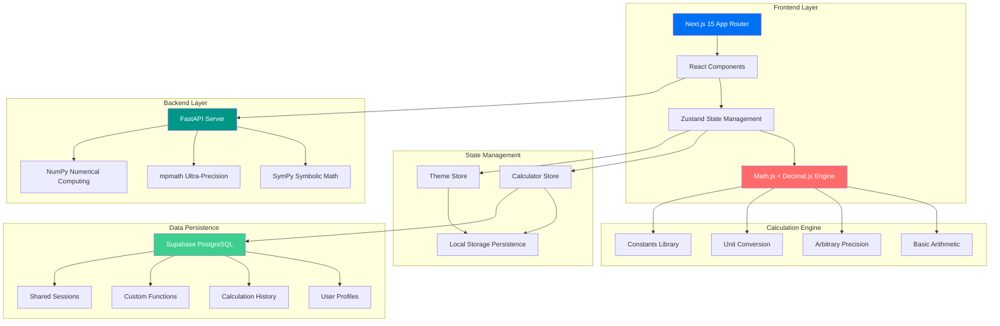
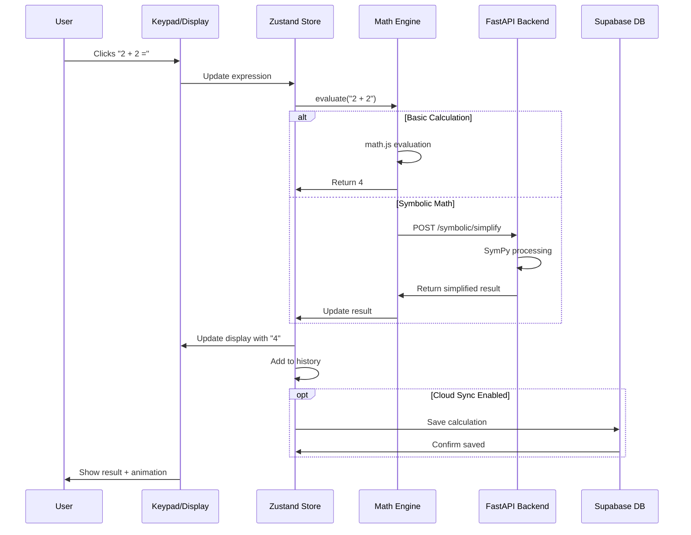
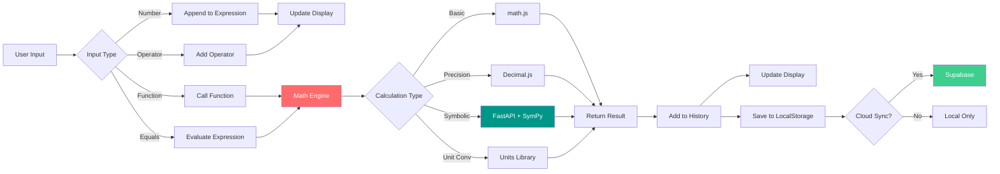
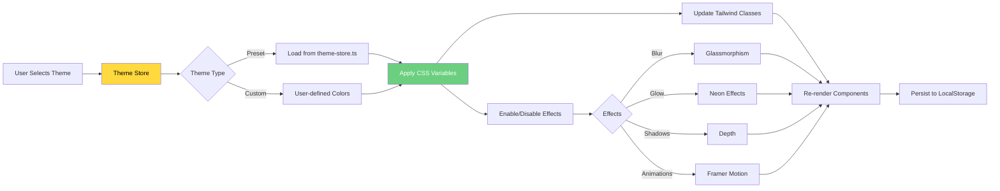
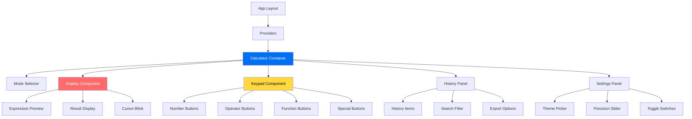

<div align="center">

# 🔮 NEXA

### **N**umerical **E**ngine for e**X**act **A**nswers

*The most beautiful, accurate, and feature-complete calculator ever built*

[](https://nextjs.org/)
[](https://www.typescriptlang.org/)
[](https://fastapi.tiangolo.com/)
[](./LICENSE)
[](http://makeapullrequest.com)

[✨ Features](#-features) • [🚀 Quick Start](#-quick-start) • [📐 How It Works](#-how-it-works) • [🎨 Themes](#-themes) • [🤝 Contributing](#-contributing)

</div>

---

## 🌟 What is NEXA?

**NEXA** is a next-generation calculator that combines the precision of arbitrary-precision arithmetic with a stunning, modern interface. Built with cutting-edge web technologies, NEXA delivers **zero floating-point errors**, **symbolic mathematics**, and **50+ beautiful themes** — all wrapped in a buttery-smooth, offline-first Progressive Web App.

> *"The calculator you screenshot and share with friends."*

---

## ✨ Features

### 🎯 Core Capabilities

| Feature | Description |
|---------|-------------|
| **🔢 Arbitrary Precision** | Never lose accuracy — compute with 10 to 10,000 decimal places |
| **🧮 10 Calculation Modes** | Basic • Scientific • Graphing • RPN • Programmer • Statistics • Financial • Matrix • Unit Converter • Date/Time |
| **🎨 50+ Themes** | Glassmorphism • AMOLED • Retro HP • Nord • Dracula • Solarized • Monokai • Gruvbox • High Contrast • Dyslexia-Friendly |
| **📴 Offline-First PWA** | Works perfectly without internet — install on any device |
| **🚀 Blazing Fast** | Sub-100ms response time with optimized calculation engine |
| **⌨️ Keyboard Shortcuts** | Power-user friendly with extensive hotkeys |
| **📊 History & Sessions** | Never lose calculations — persistent local storage + cloud sync |
| **♿ Accessibility** | WCAG AAA compliant with screen reader support |

### 🔬 Advanced Mathematics

```typescript
// Arbitrary precision (no floating-point errors!)
0.1 + 0.2 = 0.3 ✅  // Unlike JavaScript's 0.30000000000000004

// Symbolic computation
derivative("x^2 + 3x + 2", "x") → "2x + 3"
integrate("sin(x)", "x") → "-cos(x) + C"
solve("x^2 - 4 = 0", "x") → [-2, 2]

// 500+ unit conversions
convert("5 km/h", "m/s") → "1.389 m/s"

// Matrix operations
determinant([[1,2],[3,4]]) → -2
```

### 🎨 Beautiful Design

- **Glassmorphism UI** with backdrop blur effects
- **Smooth Animations** powered by Framer Motion
- **Responsive Layout** — perfect on desktop, tablet, mobile
- **Dark Mode** with multiple theme variants
- **Haptic Feedback** on mobile devices
- **Custom Fonts** — Inter + JetBrains Mono

---

## 🚀 Quick Start

### Prerequisites

```bash
Node.js 18+  |  Python 3.11+  |  npm 9+
```

### Installation

```bash
# 1️⃣ Clone the repository
git clone https://github.com/Ghost24into7/NEXA.git
cd NEXA

# 2️⃣ Install frontend dependencies
npm install

# 3️⃣ Set up environment variables (optional for basic features)
cp .env.example .env.local
# Edit .env.local with your Supabase credentials if using cloud features

# 4️⃣ Install backend dependencies
cd backend
python -m venv venv
source venv/bin/activate       # On Windows: venv\Scripts\activate
pip install -r requirements.txt
cd ..
```

### Development

```bash
# Terminal 1: Start frontend dev server
npm run dev
# → Opens at http://localhost:3000

# Terminal 2: Start backend API server
cd backend
source venv/bin/activate       # On Windows: venv\Scripts\activate
python main.py
# → API runs at http://localhost:8000
```

### Production Build

```bash
# Build optimized frontend
npm run build
npm start

# Run backend in production
cd backend
uvicorn main:app --host 0.0.0.0 --port 8000 --workers 4
```

---

## 📐 How It Works

### System Architecture



### Calculation Flow



### Data Flow Diagram



### Theme System Architecture



### Component Hierarchy



---

## 🎨 Themes

NEXA includes **50+ stunning themes** designed for every preference:

| Theme | Description | Perfect For |
|-------|-------------|-------------|
| 🌊 **Glassmorphism** | Frosted glass with blur effects | Modern aesthetics |
| 🌑 **AMOLED** | Pure black for OLED screens | Battery saving |
| 🟢 **Retro HP-42S** | Classic HP calculator style | Nostalgia |
| ❄️ **Nord** | Cool Nordic color palette | Soft on eyes |
| 🧛 **Dracula** | Popular dark theme | Night coding |
| ☀️ **Solarized Light** | Eye-friendly light theme | Daytime use |
| 🌙 **Solarized Dark** | Precision-designed dark mode | Reduced eye strain |
| 🎨 **Monokai** | Editor-inspired theme | Developers |
| 🍂 **Gruvbox** | Warm retro colors | Vintage feel |
| 👓 **Dyslexia Friendly** | High readability, OpenDyslexic font | Accessibility |
| ⚫⚪ **High Contrast** | WCAG AAA compliant | Visual impairments |
| ✨ **Custom** | Create your own! | Personal branding |

**Switch themes instantly** — no page reload required!

---

## 🧪 Available Scripts

```bash
# Development
npm run dev           # Start Next.js dev server
npm run lint          # Run ESLint
npm run type-check    # TypeScript validation
npm run format        # Format with Prettier

# Production
npm run build         # Build optimized bundle
npm run start         # Start production server

# Testing
npm run test          # Run Jest tests
npm run test:ci       # CI mode with coverage

# Version Management
npm run changeset     # Create a changeset
npm run version-packages  # Bump versions
npm run release       # Publish packages
```

---

## 🛠️ Tech Stack

<div align="center">

### Frontend


### Backend


### Database & Hosting


</div>

### Key Libraries

**Frontend:**
- `math.js` & `Decimal.js` — Arbitrary-precision arithmetic
- `Framer Motion` — Smooth animations
- `Zustand` — Lightweight state management
- `TanStack Query` — Server state management
- `Lucide React` — Beautiful icons
- `next-themes` — Theme switching

**Backend:**
- `SymPy` — Symbolic mathematics
- `mpmath` — Ultra-precision arithmetic
- `NumPy` — Numerical computing
- `Pydantic` — Data validation

---

## 🤝 Contributing

We welcome contributions from the community! Here's how you can help:

### Ways to Contribute

- 🐛 **Report bugs** — Open an issue with detailed steps to reproduce
- 💡 **Suggest features** — Share your ideas in discussions
- 📝 **Improve docs** — Help make NEXA more accessible
- 🎨 **Add themes** — Create beautiful new color schemes
- 🧮 **Add functions** — Extend the math engine capabilities
- 🌍 **Translate** — Help make NEXA available in more languages

### Development Workflow

```bash
# 1. Fork the repository on GitHub

# 2. Clone your fork
git clone https://github.com/YOUR_USERNAME/NEXA.git
cd NEXA

# 3. Create a feature branch
git checkout -b feature/amazing-feature

# 4. Make your changes and commit
git add .
git commit -m "feat: add amazing feature"

# 5. Push to your fork
git push origin feature/amazing-feature

# 6. Open a Pull Request on GitHub
```

### Commit Convention

We use [Conventional Commits](https://www.conventionalcommits.org/):

```
feat: add new calculation mode
fix: resolve floating-point precision bug
docs: update installation instructions
style: improve button hover animations
refactor: optimize math engine performance
test: add unit tests for calculator store
chore: update dependencies
```

---

## 📄 License

This project is licensed under the **MIT License** — see the [LICENSE](./LICENSE) file for details.

**TL;DR:** You can use NEXA for anything, commercially or personally, as long as you include the original license.

---

## 🌟 Star History

<div align="center">

[](https://star-history.com/#Ghost24into7/NEXA&Date)

**If you find NEXA useful, please consider giving it a star! ⭐**

</div>

---

## 💬 Support & Community

<div align="center">

[](https://github.com/Ghost24into7/NEXA/issues)
[](https://github.com/Ghost24into7/NEXA/discussions)
[](https://discord.gg/nexa)

**Need help?**
- 🐛 [Report a bug](https://github.com/Ghost24into7/NEXA/issues/new?template=bug_report.md)
- 💡 [Request a feature](https://github.com/Ghost24into7/NEXA/issues/new?template=feature_request.md)
- 💬 [Join discussions](https://github.com/Ghost24into7/NEXA/discussions)
- 📧 Email: support@nexa-calc.com

</div>

---

## 🎯 Roadmap

### ✅ Version 1.0 (Current)
- [x] Arbitrary-precision arithmetic
- [x] 10 calculation modes
- [x] 50+ themes
- [x] Offline PWA support
- [x] Keyboard shortcuts
- [x] History & persistence

### 🚧 Version 1.1 (In Progress)
- [ ] Voice input/output
- [ ] Natural language processing ("What's 15% of 200?")
- [ ] Graphing calculator with Plotly.js
- [ ] RPN mode with stack visualization
- [ ] Bit visualizer for programmer mode

### 🔮 Version 2.0 (Future)
- [ ] Real-time collaboration
- [ ] AI-powered equation solver
- [ ] Mobile apps (iOS & Android)
- [ ] Browser extension
- [ ] Wolfram Alpha integration
- [ ] LaTeX export

---

## 🙏 Acknowledgments

Built with ❤️ using these amazing open-source projects:

- [Next.js](https://nextjs.org/) — React framework
- [FastAPI](https://fastapi.tiangolo.com/) — Python web framework
- [SymPy](https://www.sympy.org/) — Symbolic mathematics
- [Tailwind CSS](https://tailwindcss.com/) — Utility-first CSS
- [Framer Motion](https://www.framer.com/motion/) — Animation library
- [Supabase](https://supabase.com/) — Open-source Firebase alternative

---

<div align="center">

**[⬆ Back to Top](#-nexa)**

Made with 🔮 by the NEXA Team

*Numerical Engine for Exact Answers*

</div>
